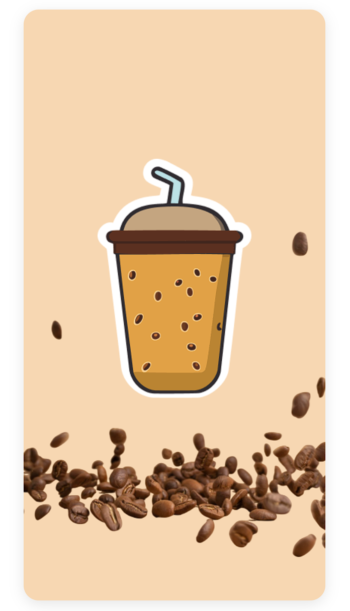
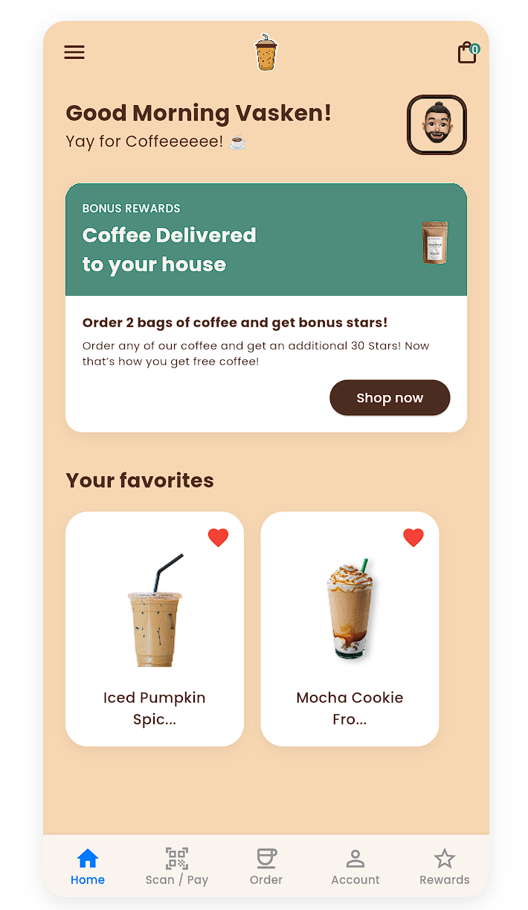
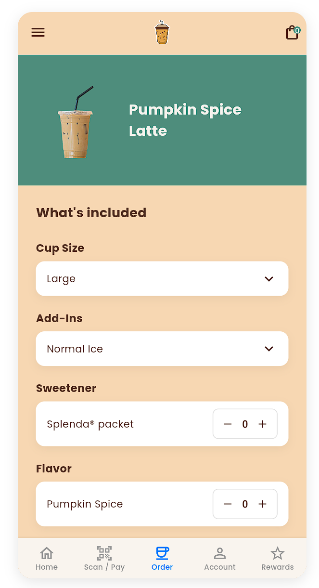
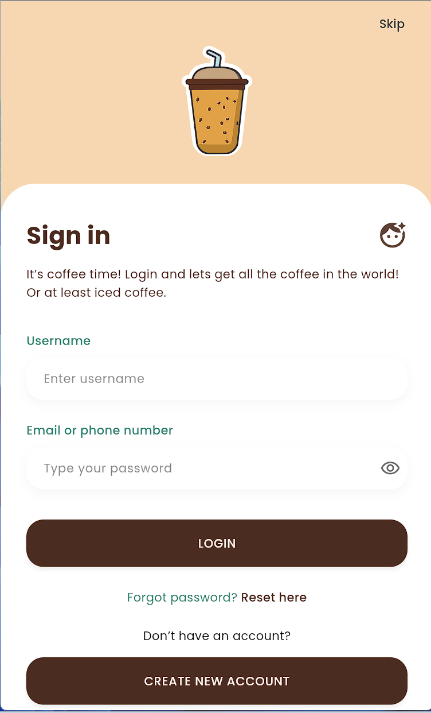
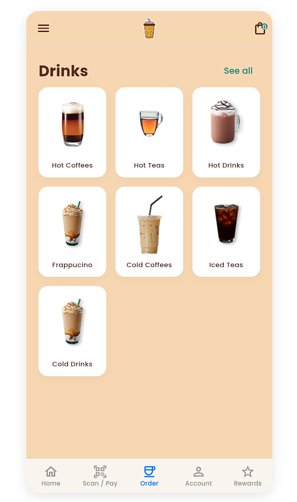
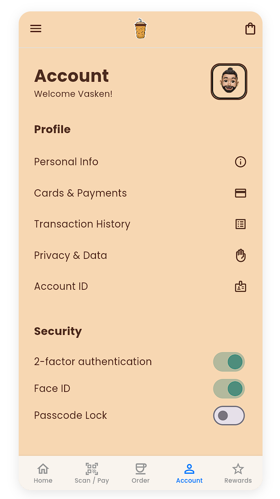
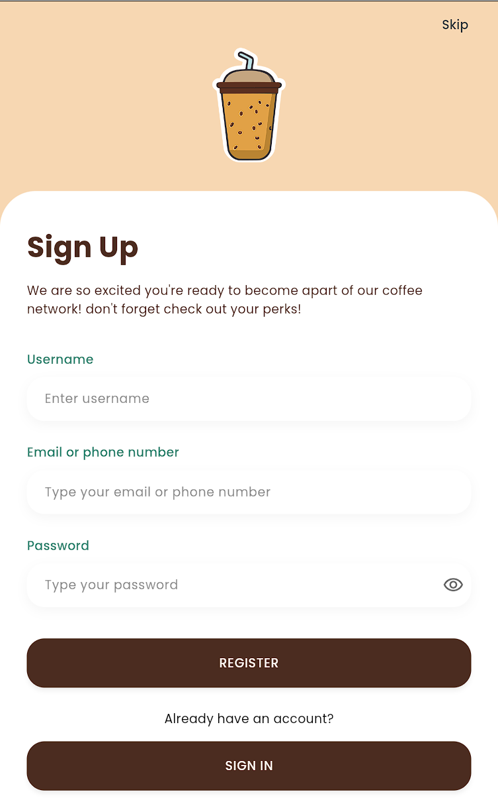

# ☕ Coffee Shop App - Лабораторна робота №4

## 📝 Опис проєкту
Цей проєкт є логічним продовженням розробки інтерфейсу мобільного додатка для кав'ярні на базі **Flutter**. Головна мета цієї роботи - реалізація повноцінної **навігації між екранами** програми, перетворення статичного макета на функціональний прототип з логічними переходами та керуванням станами маршрутів.

## 🔗 Дизайн
* [**Макет у Figma: Coffee Shop Lab 3**](https://www.figma.com/design/diW2ukySlJsCuzZQF38uVS/Coffee-Shop-Lab-3?node-id=1221-10416&t=QrSQBgwvqUWuFqOA-1)

## 🚀 Реалізована навігація
У межах лабораторної роботи №4 було впроваджено:
* **Автоматичний старт (Splash Logic)**: Додаток автоматично переходить з екрана завантаження до авторизації через 3 секунди.
* **Маршрутизація (Named Routes)**: Усі переходи централізовано налаштовані через іменовані маршрути в main.dart.
* **Логіка входу (Authentication Flow)**: Реалізовано вільний перехід між сторінками входу (Sign In) та реєстрації (Sign Up), а також перехід до головного меню після логіну.
* **Головне меню (Tab Navigation)**: Додано нижню панель (Bottom Navigation Bar) для швидкого перемикання між розділами Home, Order та Account.
* **Деталі замовлення (Deep Linking)**: Тепер при натисканні на картку кави відкривається сторінка з її описом (Detail Page).
* **Керування стеком (Pop Navigation)**: На сторінці деталей працює кнопка "Назад", яка коректно повертає користувача на попередній екран.

## 📱 Реалізовані екрани
У межах лабораторної роботи №3 було створено 7 унікальних екранів:
* **Splash Screen**: Екран завантаження з логотипом.
* **Sign In**: Екран авторизації користувача.
* **Sign Up**: Екран реєстрації нового акаунту.
* **Home Page**: Головний екран з бонусною системою та категоріями.
* **Order Page**: Меню напоїв, реалізоване через сітку (Grid view).
* **Detail Order**: Сторінка з детальним описом та налаштуванням напою.
* **Account Page**: Профіль користувача з налаштуваннями безпеки.

## 📸 Скріншоти додатку

| Splash & Auth | Main & Menu | Details & Account |
|:---:|:---:|:---:|
|  |  |  |
|  |  |  |
|  | | |
